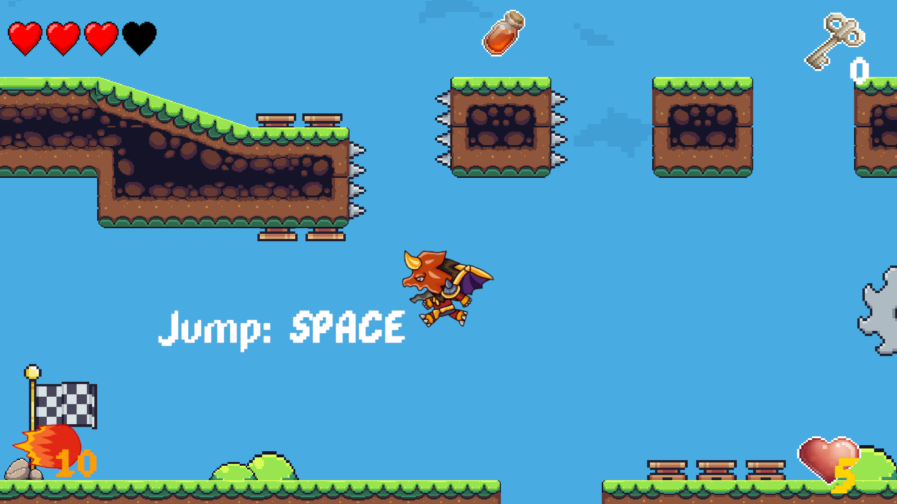
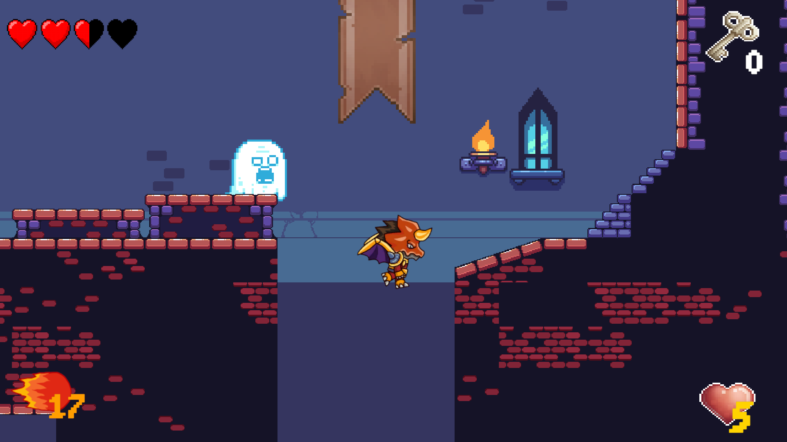

# 2DPlatformer - Dragon's Adventure

Dragon's Adventure - A Small 2D Platformer Adventure

## Overview: 
Dragon's Adventure is a compact 2D platformer game designed to showcase fundamental game development principles. This project consists of two stages, each presenting unique challenges and obstacles for the player to overcome.

## Key Features:
Two Distinct Stages:

-- Stage 1: Forest - Navigate through a forest filled with jumping platforms and hidden dangers.

-- Stage 2: Castle - Explore an ancient castle with treacherous terrain and unexpected surprises.

## Gameplay:

-- Control a brave dragon warrior as he jumps, runs, and dodges obstacles.

-- Encounter simple enemies with predefined movement patterns.

## Technical Details:

Engine: Unity 2022.3.47f1

Programming Language: C#

Graphics: 2D sprites and tilemaps
